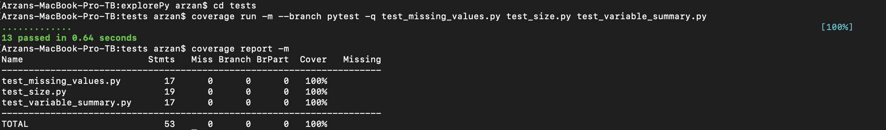

# explorePy

[](https://codecov.io/github/UBC-MDS/explorePy?branch=master)

[](https://travis-ci.org/UBC-MDS/explorePy)

### A Collaborative Software Development Project

March 2019

### Overview

explorePy is a Python package loaded with methods to help explore and explain the contents of a Pandas dataframe.

### Installation

To install explorePy, follow these instructions:

1. Input the following into the Terminal: `pip install git+https://github.com/UBC-MDS/explorePy.git`
2. The package is now installed and ready for use.


### Functions and Example Usage

Import the modules:

```
from explorePy.variable_summary import variable_summary
from explorePy.size import size
from explorePy.missing_values import missing_values
```

#### Function 1 | Variable summary
The function `variable_summary` will take a pandas data frame as input and provide the total quantity of each type of variable present in the data frame. The output of the function will be a dataframe of size 5 x 2 and will have one row for each variable type with its corresponding quantity. The function will look to identify 5 different types of variables: numerical, string, boolean, date, and an other category.

example usage of `variable_summary`:

```
frames = pd.DataFrame({'letters': ["a","b", np.nan,"d"],
                       'numbers': [1.0, 2.0, 3.0, np.nan],
                       'booleans': [np.nan, False, np.nan, True],
                       'dates': [np.datetime64("2003-01-02"), np.datetime64("2002-02-02"),
                                 np.datetime64("2004-03-03"), np.datetime64("2005-04-04")],
                       'integers': [2, 3, 4, 5]
                      })

variable_summary(frames)
```
example output of `variable_summary`:

| variable_type | count |
| ------------- | ----- |
| numeric       | 2     |
| string        | 1     |
| boolean       | 1     |
| date          | 1     |
| other         | 0     |

#### Function 2 | Missing values per variable
For each column/variable in the pandas dataframe, this function will count the number of missing values present and report back on that number per column. The function `missing_values` will accept a dataframe as input and output a corresponding dataframe with the above information detailing the counts of missing values per column/variable. If the input is of size n x d, the output size will be d x 3.

example usage of `missing_values`:

```
frames = pd.DataFrame({'letters': ["a","b", np.nan,"d"],
                       'numbers': [1.0, 2.0, 3.0, np.nan],
                       'booleans': [np.nan, False, np.nan, True],
                       'dates': [np.datetime64("2003-01-02"), np.datetime64("2002-02-02"),
                                 np.datetime64("2004-03-03"), np.datetime64("2005-04-04")],
                       'integers': [2, 3, 4, 5]
                      })

missing_values(frames)
```

example output of `missing_values`:

| columns       | no_of_missing_values | percent_missing_vals |
| ------------- | ----- | ------ |
| letters       | 1     | 0.25   |
| numbers       | 1     | 0.25   |
| booleans      | 2     | 0.50   |
| dates         | 0     | 0.00   |
| integers      | 0     | 0.00   |

#### Function3 | Dataset Size/Info
The function `size` will take in a dataframe and print the shape and size of the dataframe. For the size, the function will print how much memory the dataframe consumes in bytes. The output of the function will be a dataframe of size 1 x 3.

example usage of `size`:

```
frames = pd.DataFrame({'letters': ["a","b", np.nan,"d"],
                       'numbers': [1.0, 2.0, 3.0, np.nan],
                       'booleans': [np.nan, False, np.nan, True],
                       'dates': [np.datetime64("2003-01-02"), np.datetime64("2002-02-02"),
                                 np.datetime64("2004-03-03"), np.datetime64("2005-04-04")],
                       'integers': [2, 3, 4, 5]
                      })

size(frames)
```

example output of `size`:

| rows  | columns | size_in_bytes  |
| ----- | ------- | -------------- |
| 4     | 5       | 240            |

### Comparable Functions Available in the Python Ecosystem
The following are existing functions in Python that are similar to those developed within our project.

[df.info()](https://pandas.pydata.org/pandas-docs/stable/reference/api/pandas.DataFrame.info.html): provides summary information about a pandas dataframe, including data types for variables and number of null values.   
[df.shape()](https://pandas.pydata.org/pandas-docs/stable/reference/api/pandas.DataFrame.shape.html): provides the dimensions of a pandas dataframe.    
[df.count()](https://pandas.pydata.org/pandas-docs/stable/reference/api/pandas.DataFrame.count.html): provides the number of non-missing values in each column or row of the dataframe.  


### Collaborators:

| name | github handle |
| ---- | ------ |
| Rachel K. Riggs | [@rachelkriggs](https://github.com/rachelkriggs) |
| Milos Milic     | [@milicmil](https://github.com/milicmil) |
| Arzan Irani     | [@nazra-inari](https://github.com/nazra-inari) |
| James Pushor    | [@jpush1773](https://github.com/jpush1773)


### Test Results

#### Pytest


